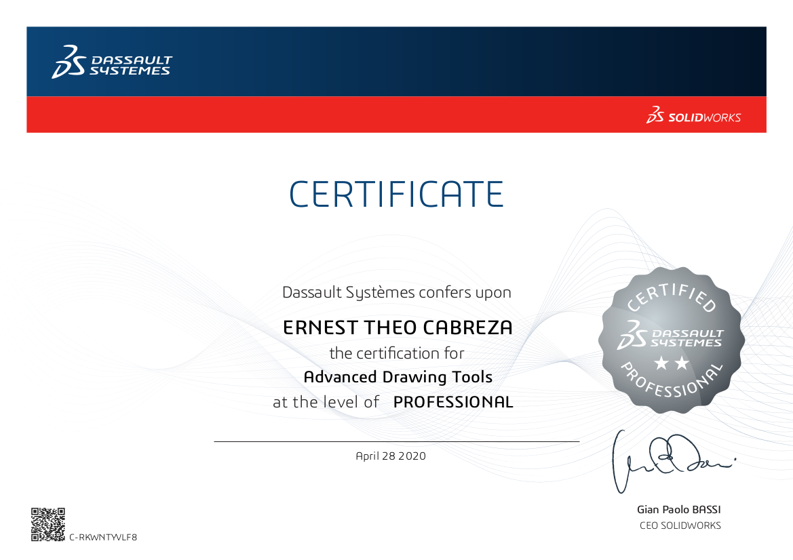
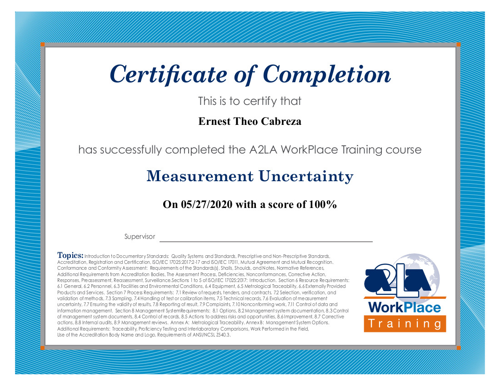

# Certificates

[Home](README.md) | [Resume](resumes.md) | [Certificates](certificates.md) | [Projects](projects.md)

## SolidWorks

[Certified SolidWorks Professional](Certificates/Certificate_C-2NVX9SBC5Y.pdf)

[Certified SolidWorks Professional Advanced Sheet Metal](Certificates/Certificate_C-HP4XVZGTL8.pdf)

[Certified SolidWorks Professional Advanced Drawing Tools](Certificates/Certificate_C-RKWNTYVLF8.pdf)

[Certified SolidWorks Professional Advanced Weldments](Certificates\Certificate_C-PTYA4V5KCF.pdf)

## American Society of Quality (ASQ)

[Measurement Uncertainity](Certificates/MeasurementUncertainty-ETC.pdf)  
*via American Association for Labortatory Accreditation (A2LA)*
